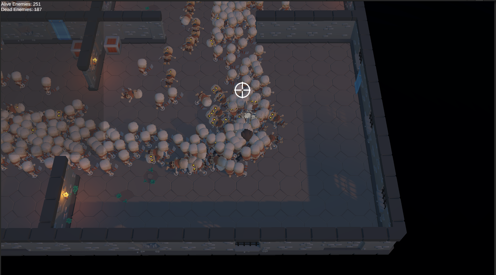

# Making a *Survivors-like* with Latios Framework Part 1

## Me, Me and Me


I've been wanting to learn Unity's Data-Oriented Technology Stack (DOTS) for a while now. Sadly, the documentation is still a bit lacking and the examples are all over the place. And I'm not even mentioning the fact that DOD is a whole new way of thinking about programming coming from an OOP background.

### The Training Samples
A month ago, I stubbled upon Unity's [DOTS training samples]([https://](https://github.com/Unity-Technologies/DOTS-training-samples)). This is pretty awesome since I'm a "learn by doing" kind of guy. Exactly what I was looking for. What is it? It's a series of small projects / simulations implemented in a classic way and the goal is to reimplemement them using DOTS.

The first project is called "Ant Phereomones". Quick pitch from the Readme:

> - Ants bring food from the source (green spot) to the destination (red spot).
> - Each ant spawns at the center point with a random heading.
> - Ants bounce off of walls at the inverse angle.
> - Ants will steer towards the food source (green dot) if they have line of sight.
> - Ants leave pheromone in the spots they walk over.
> - Ant steering is affected by pheromones, goal location (food or nest), obstacl avoidance and obstacle "bounce".
> - Pheromone at a spot decays over time.
> - Ant steering is also slightly randomized, so ants don’t walk in straight lines.
> - The gaps in the ring walls randomly vary in size and placement.
> - Keyboard controls allow the user to slow down, speed up, and reset the simulation.
> - The amount of pheromone an ant drops depends on the speed of the ant, and the speed depends on steering.

### The *CLICK*


Mission accomplished! It made DOTS click in my head. I understood the basics of how to implement a DOTS project. I was able to reimplement the project in a few days (plus some more because I tend to be quite self-demanding). I was quite impressed with the results. Without really knowing what I was doing, I was able to make a project that was running at 60fps with 100k ants on screen. I've found that the DOTS way of thinking is quite refreshing and that it encourages some good practices (sepation of concerns, data-oriented design, etc).

<video width="800" height="600" controls>
  <source src="medias/mesmerizants.mp4" type="video/mp4">
</video>

### The *What Now?*

I started looking for features required to make actual full games and if they were implemented in DOTS and then stumbled upon a post on Unity's forums by Door 407, *Diplomacy Is Not An Option*'s developers. I was shocked that if you want actual skinned and animated characters without using GameObjects, you'd have to roll your own solution.

## Latios Framework


There is this *guy* you'll see a lot if you hang around Unity's DOTS forums. **Dreaming I'm Latios**. He's been working on a framework that aims to make DOTS development easier. It's called [Latios Framework](https://github.com/Dreaming381/Latios-Framework). It's still in development but it's already quite impressive!

Latios has a good number of modules and some interesting addons. It does not forces you to use everything but manages to do, as an open source project, what you would find in paid assets:
- GPU Skinning
- Audio (I always forget about audio)
- Scene Management (haven't used it yet)
- Explicit System Ordering (!!!)
- System hierarchy (Root, Super, and Sub systems)
- Fast Physics queries
- VFX Baking
- A custom transform system tha just makes sense (QVVS)
- And more!

## Let's Make a Game!


Like I said, I'm more of a "learn by doing" kind of guy. So I'll be making a game using Latios Framework. I'll be documenting the process here. I may say complete inaccuracies, so please take everything with a grain of salt. I'm still learning.

### The Game

What kind of game could make a great use of DOTS (and Latios) ? A game genre that I'm familiar with... A *Vampire Survivors-like*, obviously!

*Aside: This game idea was suggested to me by Dreaming I'm Latios as a learning experience*

### The Plan


I had no plan when starting this project except for the fact that I wanted to make a *real* game with DOTS/Latios.

I just started with this :
- Find some CC0 assets to use (Thank you Kay Lousberg ! [https://kaylousberg.itch.io/])
- Figure out where to go with these assets
- Make a Main Menu with a Play button
- Upon pressing the Play button, load the game scene
- In the game scene, bootstrap Latios and spawn a player character
- Pressing escape pauses the game and shows a pause menu
- The pause menu has a Resume button, a Back To Main Menu button and a Quit button

It took me wey more time than I expected. Maybe because I *absolutely* wanted to bring my usual tools with me wich VContainer, Vital Router, R3 and UniTask. Sadly, VContainer's API for DOTS is pretty restrictive : it can't only register systems from existing Worlds or create new Worlds and register systems in them and I didn't manage to get ISystem injection working.

Why all the pain? Because I tend to find ECS World <-> GameObject world *communication* pretty *dirty*. So, yeah, I absolutely wanted to keep my usual tools with me, especially Vital Router (which works best with VContainer) to handle, mostly, the UI <-> ECS communication.

### How it started

I needed to figure out how to *plug* VContainer and Co into Latios / DOTS. I already had done some experiments with *pure* DOTS and Netcode for Entities: it worked but it was a pain to differentiate between client and server worlds.

Since that with the Survivors-like I'm going single player only with one single ECS World, using `builder.RegisterSystemFromDefaultWorld` would just work as Latios's bootstrap template registers the world as the `DefaultGameObjectInjectionWorld` (yep, I'm not planning to do anything fancy with the boostrap).

Additionally, I disabled the automatic world bootstrap (`UNITY_DISABLE_AUTOMATIC_SYSTEM_BOOTSTRAP_RUNTIME_WORLD`) so I could have more control over the world's lifecycle.

### Code example

Here is a stripped down sample that shows how to setup a *clean* ECS <-> UI communication with VContainer and Vital Router

`PlayLifetimeScope.cs` : A child scope of `GameLifetimeScope`.
```csharp
public class PlayLifetimeScope : LifetimeScope
{

    // This is a refenrence to a panel that will be used to show debug information
    [SerializeField] DebugPanel _debugPanel;

    protected override void Configure(IContainerBuilder builder)
    {
        builder.RegisterInstance(_debugPanel);

        // Register the PlayStateRouter that will handle the routing of game state related commands
        builder.RegisterVitalRouter(routingBuilder => 
        { 

            routingBuilder.Map<PlayStateRouter>(); 
        });

        // Register the DebugSystem that will publish commands to the PlayStateRouter
        builder.RegisterSystemFromDefaultWorld<DebugSystem>();
    }
}
```

`DebugPanel.cs` : Warning: Rocket science!

```csharp
public class DebugPanel : MonoBehaviour
{
    [SerializeField] private TMP_Text _text;
    
    public TMP_Text DebugText => _text;
}
```

`PlaystateRouter.cs`
```csharp
[Routes]
public partial class PlayStateRouter : IDisposable
{

    [Inject] private DebugPanel _debugPanel;

    /// <summary>
    /// Upon receiving a DebugCommand, we update the text of the DebugPanel
    /// </summary> 
    [Route]
    void On(DebugCommand command)
    {
        _debugPanel.DebugText.text = command.Message;
    }

    public void Dispose()
    {
        UnmapRoutes();
    }
}
```

`DebugSystem.cs` : The managed system that will be used for debugging. As an example, it will count the number of alive and dead enemies.
```csharp
public partial class DebugSystem : SystemBase
{
    ICommandPublisher _publisher;

    [Inject]
    public void Construct(ICommandPublisher publisher)
    {
        _publisher = publisher;
    }


    protected override void OnUpdate()
    {

        string message = "";
        
        var aliveEnemyCount = SystemAPI.QueryBuilder().WithAll<EnemyTag>().WithNone<DeadTag>().Build().CalculateEntityCount();
        message += $"Alive Enemies: {aliveEnemyCount}\n";
        
        var deadEnemyCount = SystemAPI.QueryBuilder().WithAll<EnemyTag>().WithAll<DeadTag>().Build().CalculateEntityCount();
        message += $"Dead Enemies: {deadEnemyCount}\n";
        
        
        _publisher.PublishAsync(new DebugCommand { Message = message });
    }
}
```

### The Result




## The Next Steps
Draw the rest of the f*cking owl!
...
I mean, implement some parts of the game loop and try some of Latios Framework's features :
- an animated 3D player character and enemies (Kinemation module)
- Add an axe throwing mechanic (Psyshock module)
- Add some kind of pathfinding and flocking behavior to the enemies
- Get sidetracked and add VFX (LifeFX module) and SFX (Myri module) just for fun!

## Conclusion


I hope this article was helpful to you. I know it was a bit all over the place and that I haven't talked much about my experience with Latios (yet) but I wanted to share my experience learning and tinkering  with DOTS and Latios Framework.

If you have some DOTS experience (from noob to pro) and haven't tried Latios Framework yet, I highly recommend you to give it a try. It's a great framework with an awesome community behind it. Come join us on Discord and share your experience with us!